# 🛒 SQL Customer-Orders-Products Analysis  

This project demonstrates SQL case study using a **Customer–Products–Orders dataset**.  
It covers queries across multiple levels: **Basic, Medium, Advanced, and Expert**, including joins, aggregations, subqueries, CTEs, and window functions.

---

## 📊 Dataset  

The dataset is **synthetic** (sample business data).  

**Tables Used:**  
- **Customers** → Customer info (ID, Name, Country, City, DOB, Gender, JoinDate)  
- **Products** → Product details (ID, Name, Category, Price)  
- **Orders** → Order transactions (ID, CustomerID, ProductID, Date, Quantity, Discount)  

---

## 📝 SQL Queries  

### 🔹 Basic Level (BQ1 – BQ5)  
| No | Question | Demo |
|----|-----------|------|
| BQ1 | List all customers with their country and city | 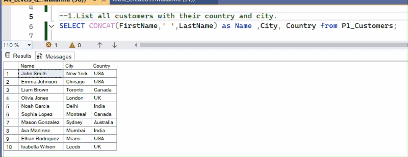 |
| BQ2 | Get all products in the “Electronics” category | 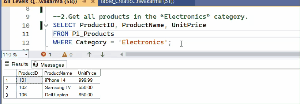 |
| BQ3 | Find the total number of customers from India | 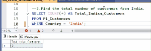 |
| BQ4 | Get the total number of orders placed | 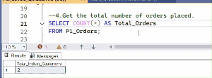 |
| BQ5 | Find total sales amount (UnitPrice × Quantity) | 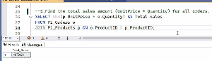 |

---

### 🔹 Medium Level (MQ1 – MQ5)  
| No | Question | Demo |
|----|-----------|------|
| MQ1 | List each customer with the products they purchased |  |
| MQ2 | Show total sales per country | 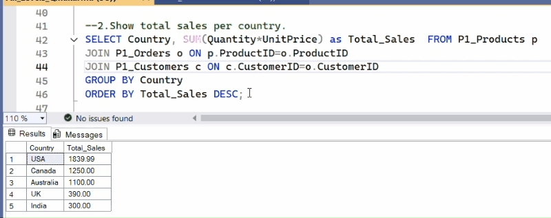 |
| MQ3 | Find average order value per customer |  |
| MQ4 | List customers who never placed an order | 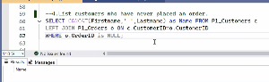 |
| MQ5 | Find top 3 products by total quantity sold | 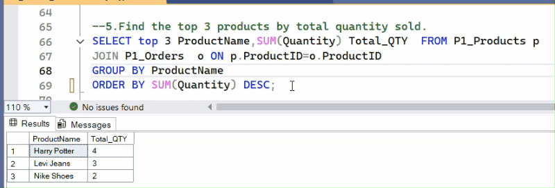 |

---

### 🔹 Advanced Level (AQ1 – AQ5)  
| No | Question | Demo |
|----|-----------|------|
| AQ1 | Find the 2nd most expensive product | 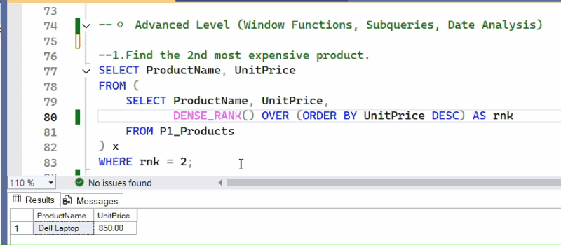 |
| AQ2 | List top 2 customers per country by spend |  |
| AQ3 | Find customers who spent above average | 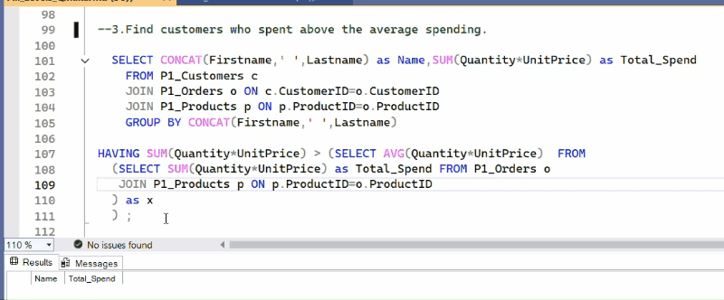 |
| AQ4 | Calculate month-over-month sales growth |  |
| AQ5 | Classify customers (High/Medium/Low spenders) |  |

---

### 🔹 Expert Level (EQ1 – EQ5)  
| No | Question | Demo |
|----|-----------|------|
| EQ1 | Find product category with highest revenue | 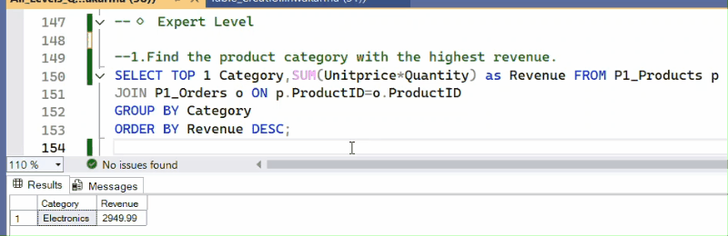 |
| EQ2 | Show running total of sales month by month | 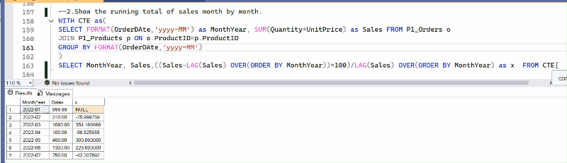 |
| EQ3 | Find orders with discounts and total savings |  |
| EQ4 | List customers with number of categories purchased | 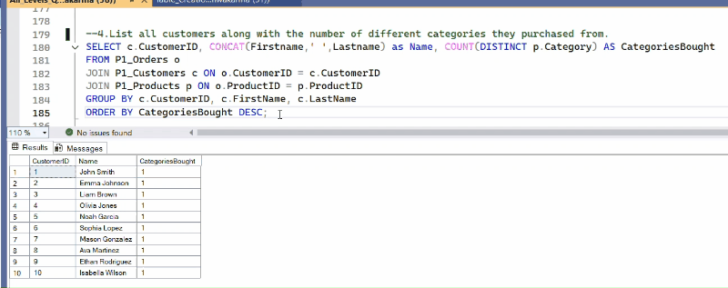 |
| EQ5 | Find customers who bought in 2022 Q1 but not in Q2 | 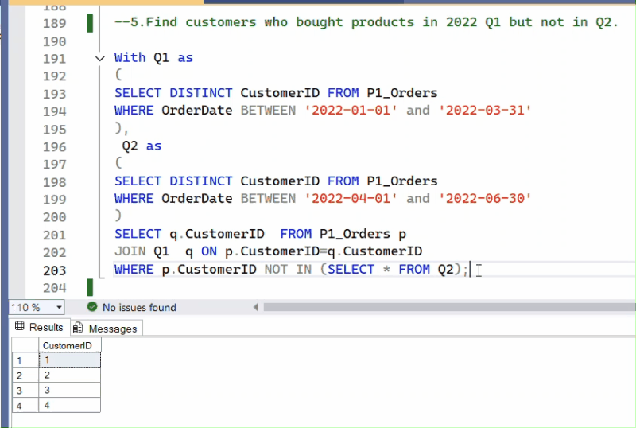 |

---

